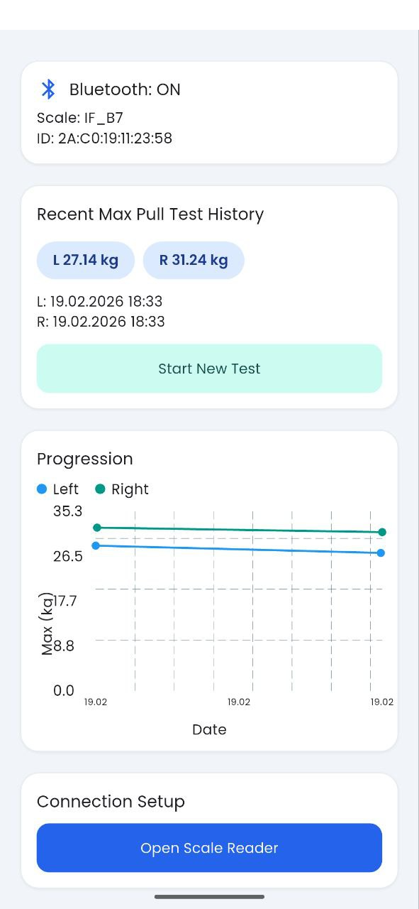
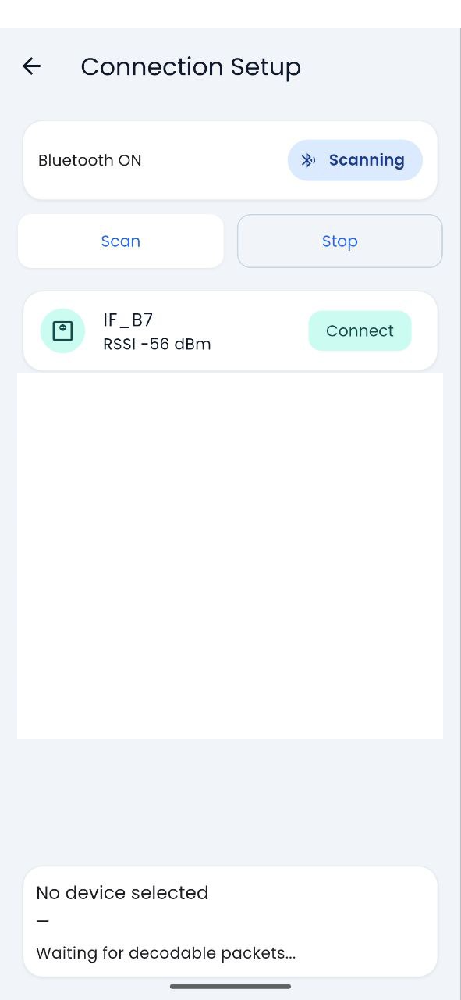
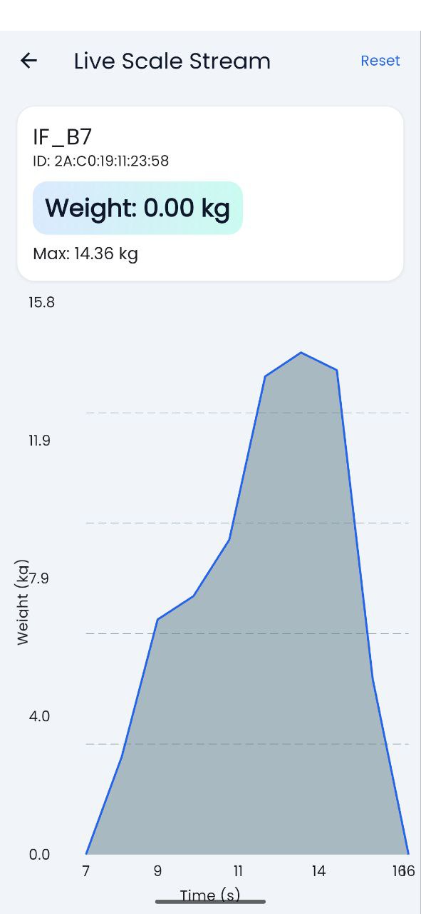
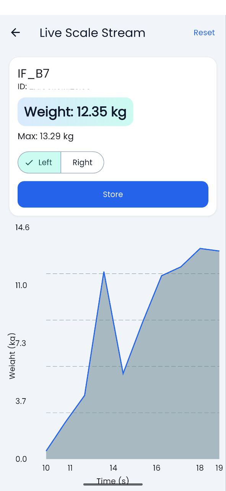

# Pull Strength BLE App

[](https://flutter.dev)


[](LICENSE)

A Flutter app for Android that connects to a BLE crane scale (WeiHeng WH-C06 compatible), decodes live readings, and tracks left/right pull test history over time.

## Features

- Scan for nearby BLE devices and connect to your scale.
- Decode advertisement payloads into live weight readings.
- View a real-time chart of incoming measurements.
- Run left/right pull tests and store max values.
- Persist test history locally on device.
- Visualize progression with left/right trend lines.

## Screenshots

### Overview



### Device Connection



### Live Reading



### Pull Test




## Tech Stack

- Flutter (Material 3)
- `flutter_blue_plus` for BLE scanning and advertisement handling
- `fl_chart` for live/progression charts
- `shared_preferences` for local history persistence


## Getting Started

### Prerequisites

- Flutter SDK installed
- Android Studio / Android SDK
- WeiHeng WH-C06 Bluetooth Crane Scale
- A physical Android device with Bluetooth support (recommended for BLE)

### Install dependencies

```bash
flutter pub get
```

### Run on Android

```bash
flutter run
```

## Usage

1. Open the app and go to the connection setup.
2. Start scanning and select your BLE scale.
3. Open the live page to monitor incoming readings.
4. Perform left/right tests and store results.
5. Review your progression chart on the overview screen.

## Notes

- BLE behavior can vary by Android version and device vendor.
- For best results, keep the scale close to the phone and minimize BLE interference.

## Future Improvements

- Export test history (CSV/JSON)
- Workouts/Guided Sessions with zones in force charts and timers to guide the workout
- Session tagging / notes
- Multi-device profile support


